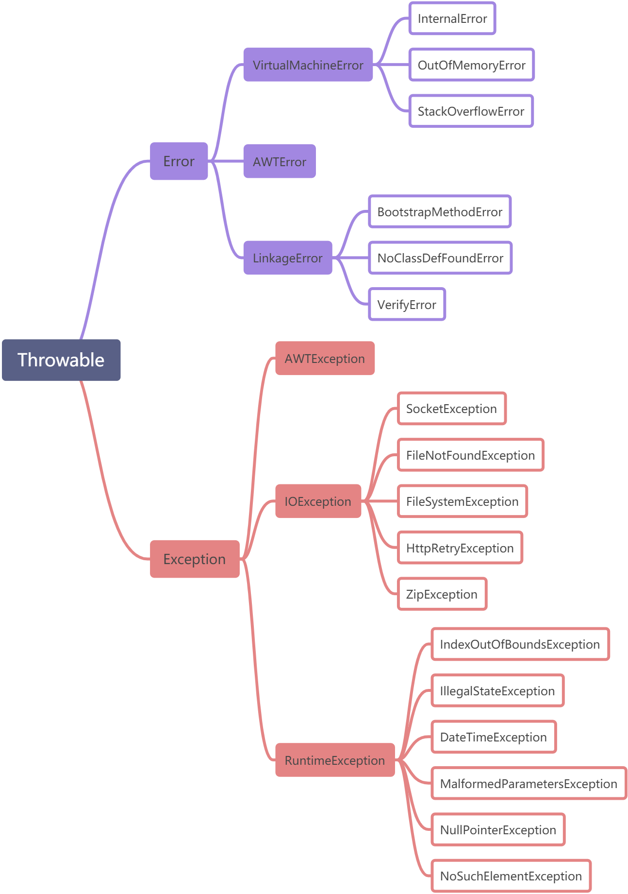

# BIGO

# 二面 0907

## 项目、论文讨论了半个小时。

&ensp;&ensp;&ensp;&ensp;### 项目中遇到过什么困难？如何解决的？

&ensp;&ensp;&ensp;&ensp;### 综述论文中讲的是什么？IoTJournal的影响因子是多少？

&ensp;&ensp;&ensp;&ensp;&ensp;&ensp;&ensp;&ensp;影响因子11.7

&ensp;&ensp;&ensp;&ensp;### 你的论文都是怎么找的？有哪些途径？

&ensp;&ensp;&ensp;&ensp;### 如何解决用户多次传输会产生耗电量过大的问题？如果用户一段时间内有多次访问请求造成耗电量过大该如何解决？

## 算法题：找出数组中出现超过一半的元素，请编写一个函数实现该功能。

&ensp;&ensp;&ensp;&ensp;利用泛型+HashMap。

## HashMap的底层原理是什么？

&ensp;&ensp;&ensp;&ensp;数组+链表，根据哈希值来进行散列后采用头插法添加元素，JDK1.8之后采用红黑树构造。

## HashMap如果想要多线程访问该如何做？

&ensp;&ensp;&ensp;&ensp;不能利用HashTable，因为它是遗留类、应该使用ConcurrentHashMap，Concurrent中采用了分段锁。

## ConcurrentHashMap中的CAS了解吗？

&ensp;&ensp;&ensp;&ensp;原子性操作，先比较是否与原值相同，相同则更改，不同则不更改。

## Java中运行时异常有哪些？

&ensp;&ensp;&ensp;&ensp;Java把异常当做对象来处理，java.lang.Throwable为所有异常的超类。

&ensp;&ensp;&ensp;&ensp;#### 可查异常

&ensp;&ensp;&ensp;&ensp;&ensp;&ensp;&ensp;&ensp;除了不可查异常都是可查异常，Java编译器会检查这种异常，当程序中出现这种异常时，必须使用try{}catch(){}语句捕获，亦或者使用throws字句声明抛出该异常（throws语句后，程序会立即终止），否则不能够编译通过。常见有IOException、SQLException等

&ensp;&ensp;&ensp;&ensp;#### 不可查异常

&ensp;&ensp;&ensp;&ensp;&ensp;&ensp;&ensp;&ensp;运行时异常（Runtime Exception及其子类）和Error。

&ensp;&ensp;&ensp;&ensp;#### Error

&ensp;&ensp;&ensp;&ensp;&ensp;&ensp;&ensp;&ensp;一般是指与虚拟机相关的问题，如系统崩溃、虚拟机出错、动态链接失败等，Error无法恢复也不可能捕获，会导致程序中断，通常应用程序也不应该捕获Error对象，也无需在throws子句中声明该方法抛出任何Error或者它的子类。一般包括OutofMemoryError，StackOverFlowError，NotClassDeFoundError（JVM或者Classloader实例尝试加载类(或者new创建对象)却找不到类的定义，要查找的类在编译时期是存在，运行期间却找不到该对象对应的类，这个时候就会导致NoClassDeFoundError错误）。

&ensp;&ensp;&ensp;&ensp;#### Exception

&ensp;&ensp;&ensp;&ensp;&ensp;&ensp;&ensp;&ensp;**运行时异常** 

&ensp;&ensp;&ensp;&ensp;&ensp;&ensp;&ensp;&ensp;IndexOutBoundsException：索引超出范围。

&ensp;&ensp;&ensp;&ensp;&ensp;&ensp;&ensp;&ensp;NullPointerException：当应用程序试图在需要对象的地方使用null。

&ensp;&ensp;&ensp;&ensp;&ensp;&ensp;&ensp;&ensp;ArithmeticException：异常运算，如整数除以0。

&ensp;&ensp;&ensp;&ensp;&ensp;&ensp;&ensp;&ensp;ClassCastException：强制类型转换不是实例的子类。

&ensp;&ensp;&ensp;&ensp;[https://www.jianshu.com/p/49d2c3975c56](https://www.jianshu.com/p/49d2c3975c56)

## 操作系统中的分页内存和分段内存有什么优缺点？

&ensp;&ensp;&ensp;&ensp;#### 分页存储管理

&ensp;&ensp;&ensp;&ensp;&ensp;&ensp;&ensp;&ensp;**优点** 

&ensp;&ensp;&ensp;&ensp;&ensp;&ensp;&ensp;&ensp;&ensp;&ensp;&ensp;&ensp;- 页长固定，因而便于构造页表、易于管理，且不存在外碎片。

&ensp;&ensp;&ensp;&ensp;&ensp;&ensp;&ensp;&ensp;**缺点** 

&ensp;&ensp;&ensp;&ensp;&ensp;&ensp;&ensp;&ensp;&ensp;&ensp;&ensp;&ensp;- 页长与程序的逻辑大小不相关。

&ensp;&ensp;&ensp;&ensp;&ensp;&ensp;&ensp;&ensp;&ensp;&ensp;&ensp;&ensp;- 不利于编程时的独立性，并给换入换出处理、存储保护和存储共享等操作造成麻烦。

&ensp;&ensp;&ensp;&ensp;#### 分段存储管理

&ensp;&ensp;&ensp;&ensp;&ensp;&ensp;&ensp;&ensp;**优点** 

&ensp;&ensp;&ensp;&ensp;&ensp;&ensp;&ensp;&ensp;&ensp;&ensp;&ensp;&ensp;- 段的逻辑独立性使其易于编译、管理、修改和保护，也便于多道程序共享。

&ensp;&ensp;&ensp;&ensp;&ensp;&ensp;&ensp;&ensp;&ensp;&ensp;&ensp;&ensp;- 段长可以根据需要动态改变，允许自由调度，能更有效地利用主存空间。

&ensp;&ensp;&ensp;&ensp;&ensp;&ensp;&ensp;&ensp;&ensp;&ensp;&ensp;&ensp;- 方便编程，分段共享、分段保护、动态链接、动态增长。

&ensp;&ensp;&ensp;&ensp;&ensp;&ensp;&ensp;&ensp;**缺点** 

&ensp;&ensp;&ensp;&ensp;&ensp;&ensp;&ensp;&ensp;&ensp;&ensp;&ensp;&ensp;- 主存空间分配比较麻烦。

&ensp;&ensp;&ensp;&ensp;&ensp;&ensp;&ensp;&ensp;&ensp;&ensp;&ensp;&ensp;- 容易在段间留下许多碎片，造成存储空间利用率降低。

&ensp;&ensp;&ensp;&ensp;&ensp;&ensp;&ensp;&ensp;&ensp;&ensp;&ensp;&ensp;- 由于段长不一定是2的整数次幂，因而不能简单地像分页方式那样用虚拟地址和实存地址的最低若干二进制位作为段内地址，并与段号进行直接拼接，必须用加法操作通过段起址与段内地址的求和运算得到物理地址。因此，段式存储管理比页式存储管理方式需要更多的硬件支持。

&ensp;&ensp;&ensp;&ensp;#### 段页式存储管理

&ensp;&ensp;&ensp;&ensp;&ensp;&ensp;&ensp;&ensp;**优点** 

&ensp;&ensp;&ensp;&ensp;&ensp;&ensp;&ensp;&ensp;&ensp;&ensp;&ensp;&ensp;- 提供了大量的虚拟存储空间。

&ensp;&ensp;&ensp;&ensp;&ensp;&ensp;&ensp;&ensp;&ensp;&ensp;&ensp;&ensp;- 能够更加有效地利用主存，为组织多道程序运行提供了方便。

&ensp;&ensp;&ensp;&ensp;&ensp;&ensp;&ensp;&ensp;**缺点** 

&ensp;&ensp;&ensp;&ensp;&ensp;&ensp;&ensp;&ensp;&ensp;&ensp;&ensp;&ensp;- 增加了硬件成本、系统的复杂性和管理上的开销。

&ensp;&ensp;&ensp;&ensp;&ensp;&ensp;&ensp;&ensp;&ensp;&ensp;&ensp;&ensp;- 存在着系统发生抖动的风险。

&ensp;&ensp;&ensp;&ensp;&ensp;&ensp;&ensp;&ensp;&ensp;&ensp;&ensp;&ensp;- 存在内碎片。

&ensp;&ensp;&ensp;&ensp;&ensp;&ensp;&ensp;&ensp;&ensp;&ensp;&ensp;&ensp;- 各种表格需要占用主存储空间。

&ensp;&ensp;&ensp;&ensp;[https://blog.csdn.net/zephyr_be_brave/article/details/8944967](https://blog.csdn.net/zephyr_be_brave/article/details/8944967)

&ensp;&ensp;&ensp;&ensp;[https://www.cnblogs.com/xosg/p/10257816.html](https://www.cnblogs.com/xosg/p/10257816.html)

